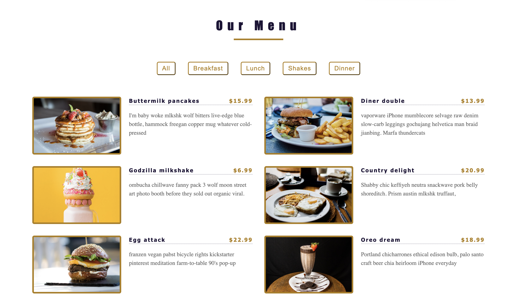

# Image gallery

> A simple

## Table of contents

- [General info](#general-info)
- [Screenshots](#screenshots)
- [Technologies](#technologies)
- [Setup](#setup)
- [Features](#features)
- [Status](#status)
- [Inspiration](#inspiration)
- [Contact](#contact)

## General info

> The objective of the project is to practice separation of concern in
> JavaScript.

## Screenshots

## Technologies

- JavaScript
- HTML5
- CSS3
- VSC code

## Setup

clone the repo and start using the stop watch.

## Code Examples

const filterHandler = (button => {
    const menuItems = document.querySelectorAll('.menu-item');
    menuItems.forEach((item) => {
        const id = button.id;
        if (id === 'all') {
            item.classList.remove('hidden');
        } else if (item.classList.contains(id)) {
            item.classList.remove('hidden');
        } else {
            item.classList.add('hidden');
        }
    });
});

export default filterHandler;

## Features

List of features ready and Todos for future development

- Html
- css
- js

To-do list:

-
-

## Status

Project is: done

## Inspiration

## Contact
